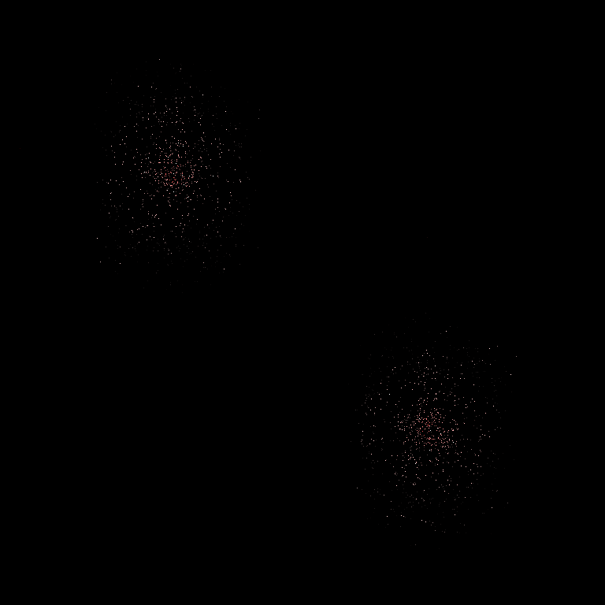

# Problem milijon teles

---
### Avtorja
* Jordan Lesjak
* Timen Stepišnik Perdih
---
### Poganjanje programov na več jedrih (primer za 4 jedra)
```julia
$ export JULIA_NUM_THREADS=4
$ julia -p 4
julia> include("million.jl")
julia> @time main()
```
### Izdelava animacije
```bash
$ FPS=20
$ convert -delay 1x$FPS frame????.png out.gif
```

## Predstavitev problema
Problem milijon teles je problem napovedovanja gibanja velikega števila teles, 
ki med seboj vplivajo s silo gravitacije. Reševanje tega problema je analitično
zelo težavno, zato se ga za večje število teles rešuje numerično. Zaradi vpliva vsakega telesa na vsako telo
je cilj implementirati časovno čim manj zahteven algoritem za ustvarjanje animacije gibanja teles.
Ker je sila med telesi gravitacijska, bodo animacije predstavljale množico teles, ki krožijo okoli enega
ali več bolj masivnih teles.

## Pristop k reševanju
Problem se lahko prevede na reševanje sledečega sistema diferencialnih enačb:


Reševanja se lahko lotimo s katerokoli metodo za numerično reševanje 
diferencialnih enačb. Zaradi hitrosti in enostavnosti implementacije 
sva za to uporabila Eulerjevo metodo. 

### Grafični prikaz gibanja
Za grafični prikaz gibanja je sedaj potrebno po vsakem koraku Eulerjeve
metode izrisati stanje teles. To sva naredila z ustvarjanjem slike ob
vsaki iteraciji. V prazno matriko RGB pikslov se za vsako telo pobarva 
pripadajoč piksel, glede na lastnosti tega telesa. 
Barvanje poteka na sledeč način: vsako telo se pobarva z intenziteto barve, 
ki je proporcionalna z komponenti njene lokacije. S tem se ustvari občutek
prostorske globine, ki se ob projekciji 3D prostora na 2D sliko sicer izgubi. 
Barva piksla se določi glede na dolžino vektorja trenutne hitrosti telesa. 
Hitrost je prikazana na intervalu od čiste rdeče barve (zelo hitro telo) do
čiste bele barve (zelo počasno telo). Ob velikem številu teles dostikrat pride
tega, da več kot eno telo pade na isti piksel. Ta problem sva rešila tako, da 
sva zmanjšala intenziteto vsakega posameznega telesa in ob računanju barve za 
vsak piksel seštevala barve vseh teles, ki padejo nanj. Matrika pikslov se 
nato pretvori v sliko formata PNG, te se pa pretvorijo v GIF. 
Za pretvarjanje se lahko uporabi programa FFmpeg ali ImageMagick. 

###  Začetni pogoji
Za razvoj programa do te točke je zadoščalo testiranje z resničnimi podatki 
našega osončja, za razširitev na večje število teles jih bo pa potrebno generirati.  

|  |
|:--:| 
| Primer za naše (nepopolno) osončje |

Za generiranje začetnih pogojev sva izdelala funkcijo, ki za podan seznam točk 
naključno generira gruče teles. Na sredini vsake gruče je telo, ki ima večjo maso 
od ostalih. Vektor hitrosti tega telesa je vnaprej določen in določa smer, 
v katero se bo premikala celotna gruča, vektorji hitrosti za ostala telesa so pa
določeni tako, da so pravokotni na njihov krajevni vektor glede na središčno telo.
Velikost vektorja hitrosti telesa je določena z enačbo: (masa središčnega telesa) / (razdalja do središčnega telesa). 
Ob takih pogojih bodo telesa krožila okoli središča svoje gruče. Za vse primere 
sva uporabila dve gruči, vendar funkcija omogoča generiranje začetnih pogojev za 
poljubno število gruč. 

###  Optimizacija 
Numerično reševanje tega sistema enačb je zelo časovno potratna, sploh pri 
večjem številu teles. Časovna kompleksnost računanje enega koraka v odvisnosti od števila teles je namreč O(n²). 
Iz tega razloga sva se odločila, da problem rešujeva v [hitrem](https://julialang.org/benchmarks/) programskem jeziku.
Poleg tega sva program kar precej pohitrila tudi s paralelnim računanjem enačb sistema. 
	
	
## Težave
Opazila sva nekaj anomalij, 
in sicer včasih, ko dve telesi prideta zelo blizu, manjšega od njiju odnese iz orbite. To se zgodi, ker telo zaradi bližine dobi ogromen pospešek, v naslednji iteraciji je pa že dovolj oddaljeno, da pobegne. To sva do neke mere rešila z uvedbo omejitve minimalne razdalje, s katero se računa pospešek. To je preprečilo pobeg planetov iz orbite, vendar precej krši zakone fizike, zato sva jo na koncu opustila.  

|  | 
|:--:|
| Dve telesi pobegneta iz orbite |

Še ena anomalija se je pojavila pri simulaciji mimobežnih galaksij. Zaradi hitrega premikanja gruče se včasih zgodi, da 
nekaj teles pusti za seboj. To je verjetno posledica slabe postavitve začetnih pogojev. Ostali primeri te težave nimajo, saj dopuščajo dovolj nizke hitrosti gruč, da se to ne zgodi.

|  |
|:--:|
| Gruči ob hitrem premikanju pustita nekaj teles za seboj |

## Rezultati

Sledeče animacije prikazujejo delovanje končnega programa.

|  |
|:--:|
| Primer za dve gruči po 1000 teles, ki trčita |

|  |
|:--:|
| Primer za dve mimobežni gruči po 1000 teles |

## Zaključki in komentarji

### Časovna zahtevnost

Zaradi vpliva vsakega telesa na vsako drugo telo, časovna zahtevnost programa kvadratno narašča s številom teles. 
V rezultatih sta prikazana primera z 2000 telesi, ki je trajal 1937 sekund, in s 6000 telesi, ki je trajal 11186 sekund (izvajano na INTEL i5-8300H).

### Zanimivost

Pri ustvarjanju pravilnih pogojev za telesa, sva preizkusila veliko kombinacij ne le začetnih pogojev, pač pa tudi 
v računanju gravitacijske sile. Eden izmed poskusov je vključeval spremenitev vpliva razdalje med telesa z r^3 na r^2
in prikazal zanimive rezultate, zato tukaj prikazujeva še tako dobljeno animacijo.

|  |
|:--:|
| Primer za dve gruči po 3000 teles, pri zmanjšanju vpliva razdalje med telesi |


###  izboljšava natančnosti računanja
Prva ideja za izboljšavo je reševanje enačb z uporabo metode z adaptivno dolžino koraka.
Ugotovila sva, da Eulerjeva metoda večino časa deluje sprejemljivo, vendar na majhnem številu 
korakov naredi ogromno napako. 

| |
|:--:|
| Vrtilna količina ene gruče teles |

||
|:--:| 
| Vrtilna količina dveh gruč, ki trčita. Napaka naraste ob trku | 

Napako sva merila s spremembo v vrtilni količini celotnega sistema,
ki naj bi ob idealni simulaciji ostala konstantna. Dolžino koraka bi lahko prilagajali glede na 
spremembo v vrtilni količini.   
  
Še en pristop k reševanju tega problema bi bil, da bi korak, ki je povzročil ogromno napako, 
izvedel znova, z manjšo dolžino koraka. S tem bi se izognil pojavu, ki je prikazan na zgornji sliki, 
kjer ogromna napaka nastane v zgolj enem koraku, in nadaljno zmanjševanje dolžine koraka ni koristno. 

### Nadaljna pohitritev izvajanja
Program bi se lahko (na račun natančnosti) precej hitreje izvajal, če bi za računanje uporabljal
prostorsko delitev teles. Sile na telo bi za bližnja telesa računal po običajnem postopku, za 
zelo oddaljena telesa bi jih pa lahko aproksimiral.

Hitrejše izvajanje bi omogočilo tudi izvajanje programa na GPU. 


### Razdelitev dela
Delo ni bilo striktno razdeljeno, saj je vključevalo veliko poskušanja različnih kombinacij znotraj celotnega programa. Okvirna zadolženost za kodo 
je narekovala skrbništvo za Eulerjevo metodo in kreairanje animacije Jordanu Lesjaku, generiranje teles, njihovih mas, pozicij in začetnih hitrosti pa Timnu
Stepišniku Perdihu.

## Viri in literatura


