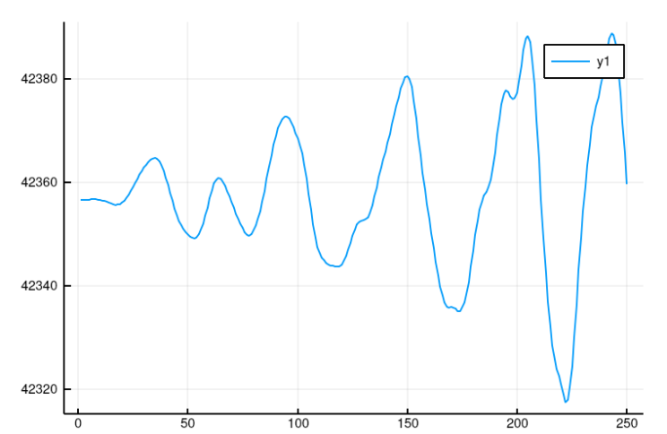
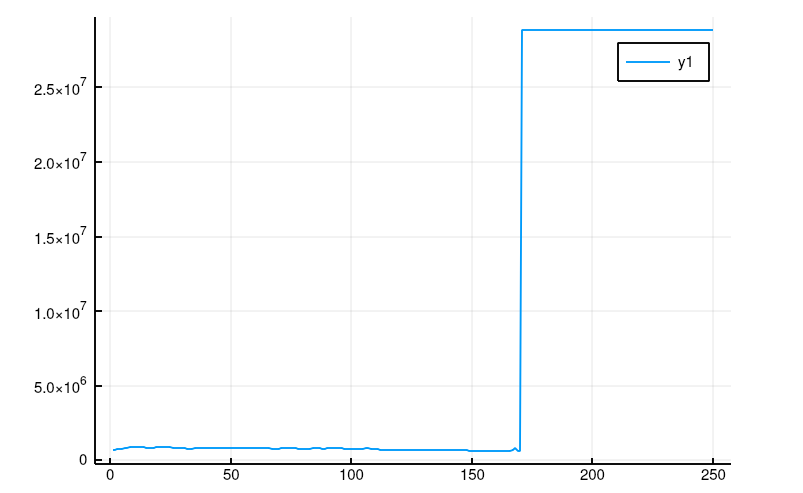

# Million Body Problem

### Poganjanje programov na več jedrih (primer za 4 jedra)
```julia
$ export JULIA_NUM_THREADS=4
$ julia -p 4
julia> include("clusters.jl")
julia> @time main()
```

## Primer za naše (nepopolno) osončje


### Vrtilna količina sistema ene gruče teles



## Primer za dve gruči po 30 teles, ki trčita


### Vrtilna količina sistema dveh druč teles, ki trčita

