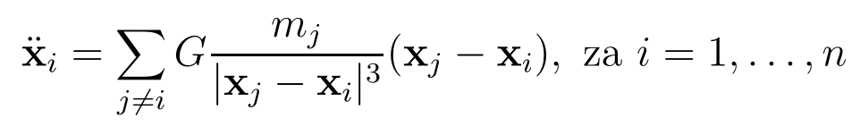
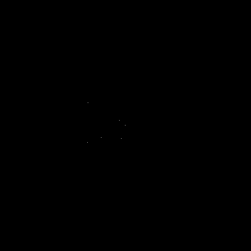
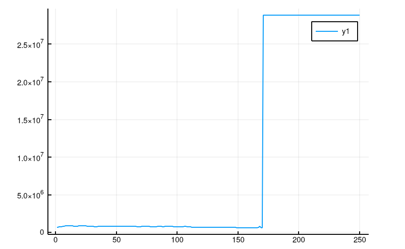
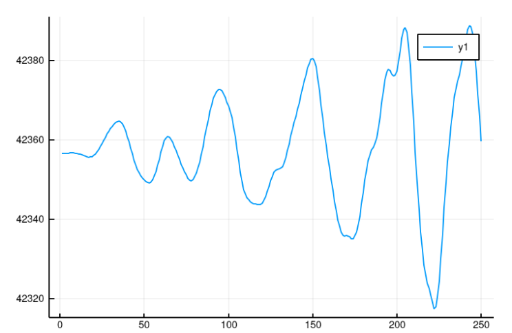
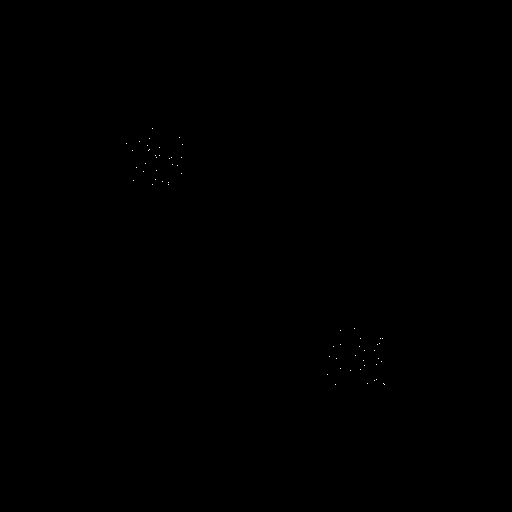
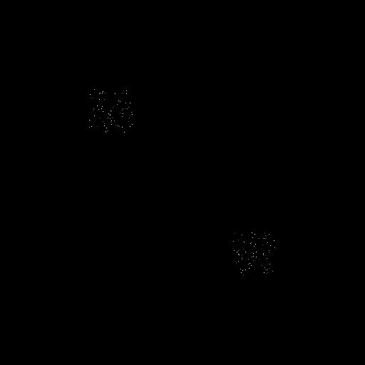
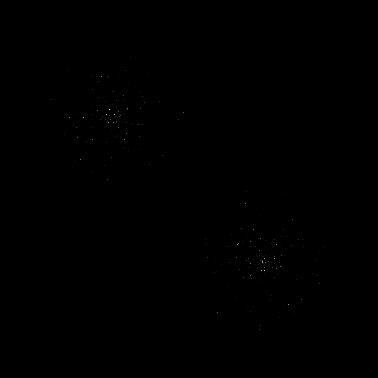
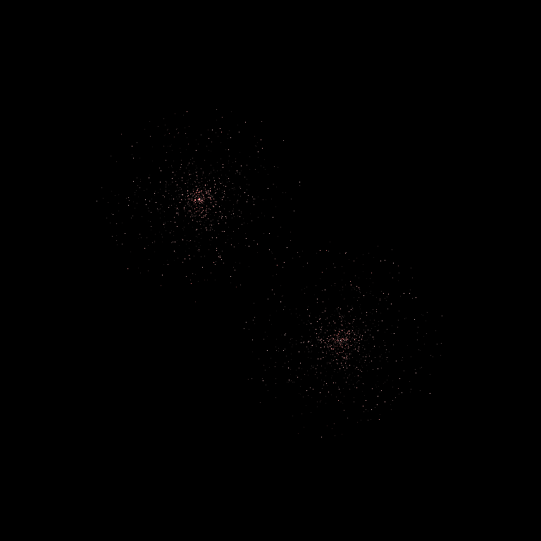
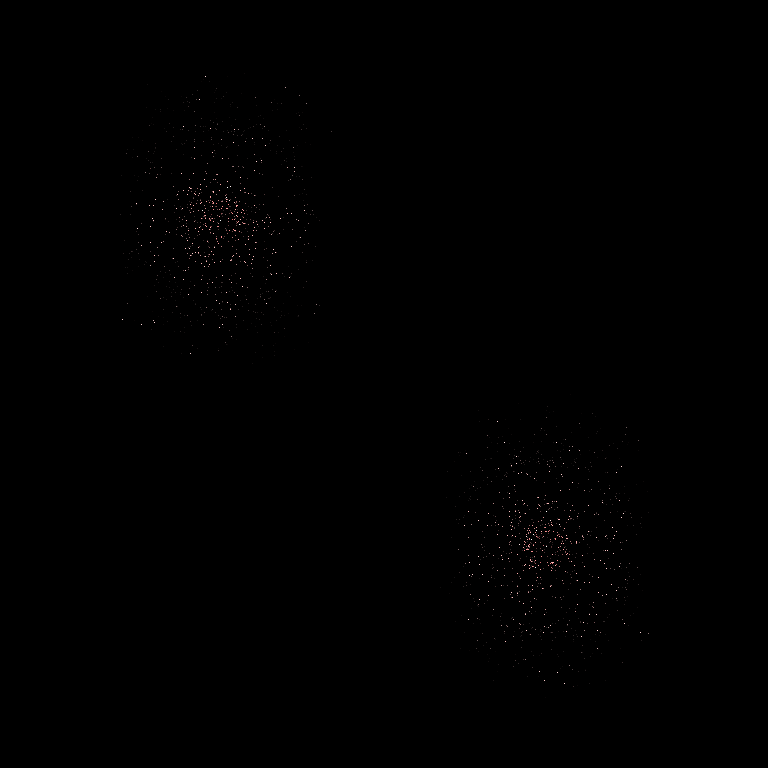
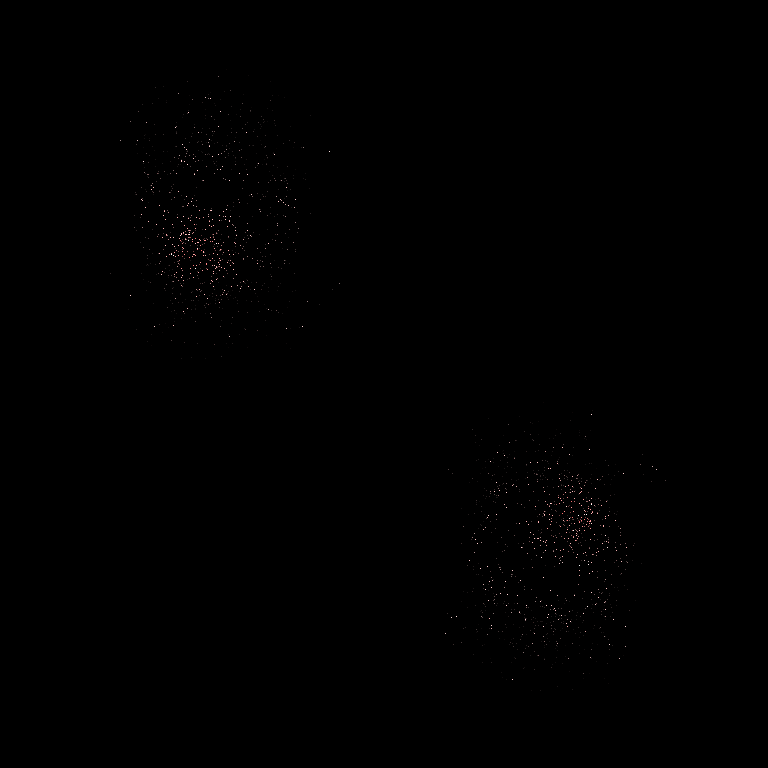

### Poganjanje programov na več jedrih (primer za 4 jedra)
```julia
$ export JULIA_NUM_THREADS=4
$ julia -p 4
julia> include("million.jl")
julia> @time main()
```
### Izdelava animacije
```bash
$ FPS=20
$ convert -delay 1x$FPS frame????.png out.gif
```

# Problem milijon teles

## Predstavitev problema
Problem milijon teles je problem napovedovanja gibanja velikega števila teles, 
ki med seboj vplivajo s silo gravitacije. Reševanje tega problema je analitično
zelo težavno, zato se ga za večje število teles rešuje numerično.

## Pristop k reševanju
Ta problem se lahko prevede na reševanje sledečih enačb:



Reševanja se lahko lotimo s katerokoli metodo za numerično integracijo.
Zaradi hitrosti in enostavnosti implementacije sva za to uporabila 
Eulerjevo metodo. 

### Grafični prikaz gibanja
Za grafični prikaz gibanja je sedaj potrebno po vsakem koraku Eulerjeve
metode izrisati stanje teles. To sva naredila z ustvarjanjem slike ob
vsaki iteraciji. V prazno matriko RGB pikslov se za vsako telo pobarva 
pripadajoč piksel, glede na lastnosti tega telesa. 
Barvanje poteka na sledeč način: vsako telo se pobarva z intenziteto barve, 
ki je proporcionalna z komponenti njene lokacije. S tem se ustvari občutek
prostorske globine, ki se ob projekciji 3D prostora na 2D sliko sicer izgubi. 
Barva piksla se določi glede na dolžino vektorja trenutne hitrosti telesa. 
Hitrost je prikazana na intervalu od čiste rdeče barve (zelo hitro telo) do
čiste bele barve (zelo počasno telo). Ob velikem številu teles dostikrat pride
tega, da več kot eno telo pade na isti piksel. Ta problem sva rešila tako, da 
sva zmanjšala intenziteto vsakega posameznega telesa in ob računanju barve za 
vsak piksel seštevala barve vseh teles, ki padejo nanj. Matrika pikslov se 
nato pretvori v sliko formata PNG, te se pa pretvorijo v GIF. 
Za pretvarjanje se lahko uporabi programa FFmpeg ali ImageMagick. 

###  Začetni pogoji
Za razvoj programa do te točke je zadoščalo testiranje z resničnimi podatki 
našega osončja, za razširitev na večje število teles jih bo pa potrebno generirati.  

|  |
|:--:| 
| Primer za naše (nepopolno) osončje |

Za generiranje začetnih pogojev sva izdelala funkcijo, ki za podan seznam točk 
naključno generira gruče teles. Na sredini vsake gruče je telo, ki ima večjo maso 
od ostalih. Vektor hitrosti tega telesa je vnaprej določen in določa smer, 
v katero se bo premikala celotna gruča, vektorji hitrosti za ostala telesa so pa
določeni tako, da so pravokotni na njihov krajevni vektor, glede na središče gruče. 
Ob takih pogojih bodo telesa krožila okoli središča svoje gruče. Za vse primere 
sva uporabila dve gruči, vendar funkcija omogoča generiranje začetnih pogojev za 
poljubno število gruč. 

###  Optimizacija 
Numerično reševanje tega sistema enačb je zelo časovno potratna, sploh pri 
večjem številu teles. Časovna kompleksnost računanje enega koraka je namreč O(n^2). 
Iz tega razloga sva se odločila, da problem rešujeva v hitrem programskem jeziku (Julia).
Poleg tega sva program kar precej pohitrila tudi s paralelnim računanjem enačb sistema. 
	// dodaj nekaj o tem kako izjemno hiter je program
	
	

## Rezultati


## (Neuresničene) ideje za izboljšavo

###  izboljšava natančnosti računanja
Prva ideja za izboljšavo je reševanje enačb z uporabo metode z adaptivno dolžino koraka.
Ugotovila sva, da Eulerjeva metoda večino časa deluje sprejemljivo, vendar na majhnem številu 
korakov naredi ogromno napako. 

||
|:--:| 
| *Vrtilna količina dveh gruč, ki trčita. napaka naraste ob trku*| 

Napako sva merila s spremembo v vrtilni količini celotnega sistema,
ki naj bi ob idealni simulaciji ostala konstantna. Dolžino koraka bi lahko prilagajali glede na 
spremembo v vrtilni količini. 
Še en pristop k reševanju tega problema bi bil, da bi korak, ki je povzročil ogromno napako, 
izvedel znova, z manjšo dolžino koraka. S tem bi se izognil pojavu, ki je prikazan na (Figure 3), 
kjer ogromna napaka nastane v zgolj enem koraku, in nadaljno zmanjševanje dolžine koraka ni koristno. 

### Nadaljna pohitritev izvajanja
Program bi se lahko (na račun natančnosti) precej hitreje izvajal, če bi za računanje uporabljal
prostorsko delitev teles. Sile na telo bi za bližnja telesa računal po običajnem postopku, za 
zelo oddaljena telesa bi jih pa lahko aproksimiral. 

## Viri in literatura


## Primer za naše (nepopolno) osončje


### Vrtilna količina sistema ene gruče teles



## Primer za dve gruči po 30 teles, ki trčita



### Vrtilna količina sistema dveh druč teles, ki trčita


## Primer za dve gruči po 75 teles, ki trčita


## Primer za mimobežni galaksiji (500 teles)



## Primer za 2000 teles



